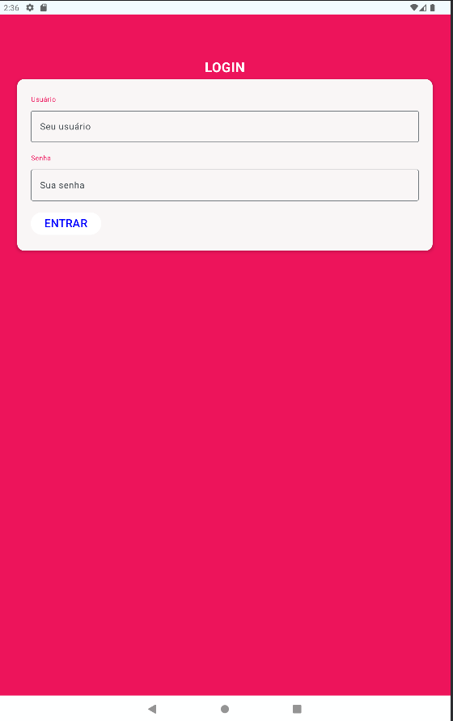
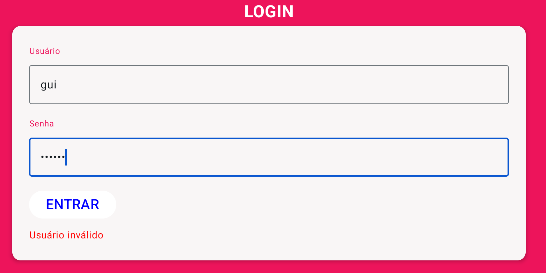
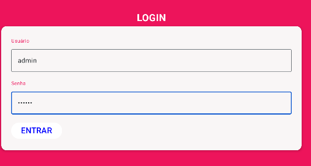
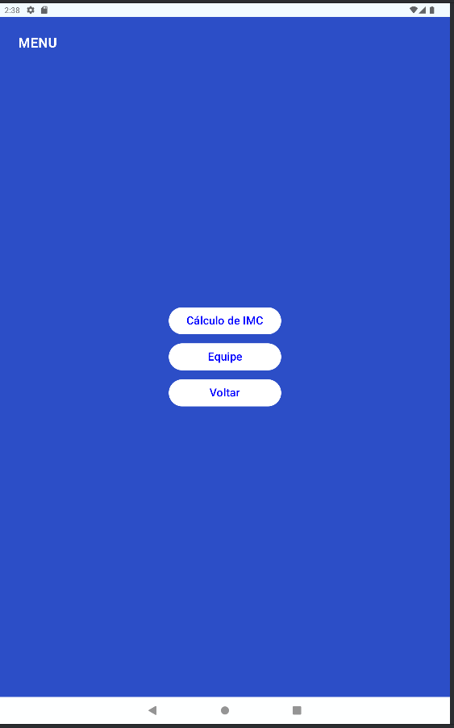
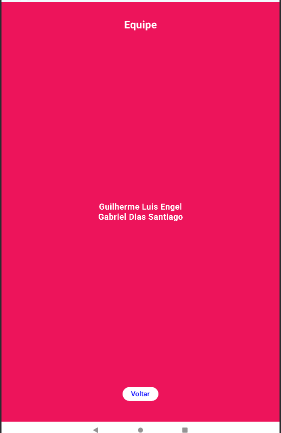
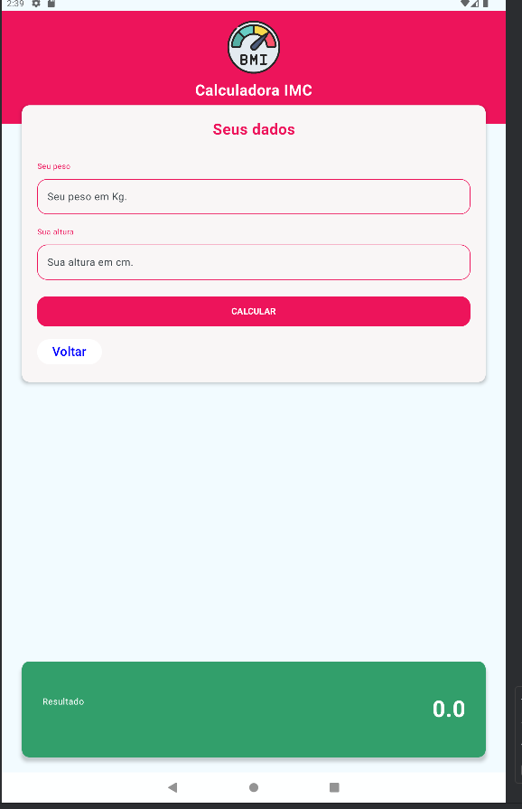
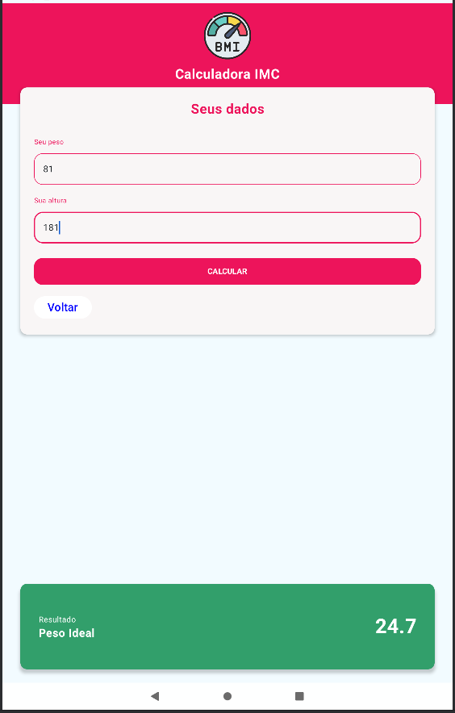

# Global Solution - Kotlin
Github: github.com/guiengel

## Equipe
RM 87438 - Guilherme Luis Engel

RM 551406 - Gabriel Dias Santiago

## Aplicação rodando
Tela de Login

---
Botando o usuário errado

---
Botando o usuário certo

---
Com o usuário certo, acessou a screen de Menu

---
Tela equipe

---
Tela IMC

---
Tela fazendo o cálculo do IMC

